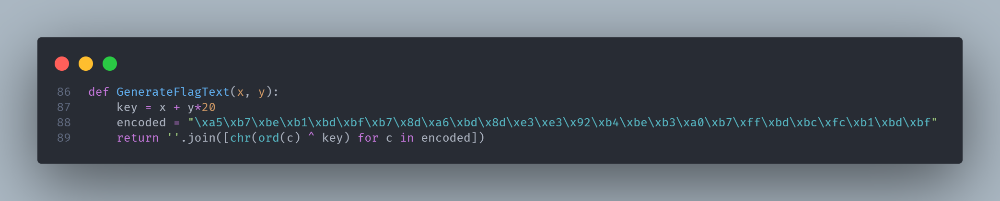
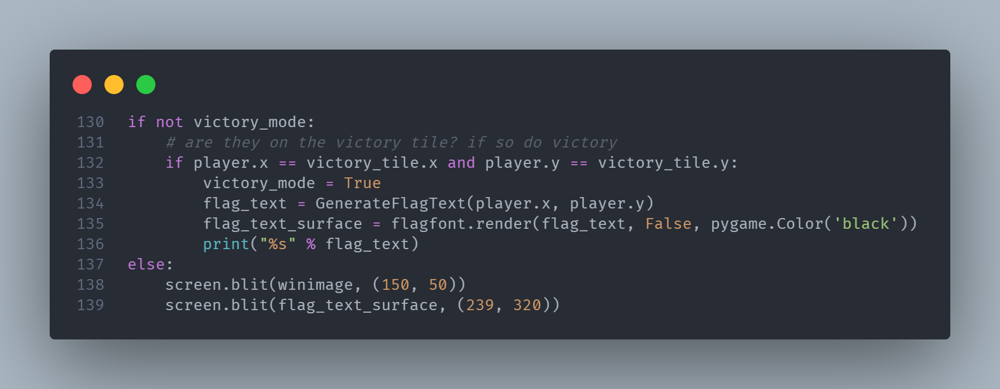
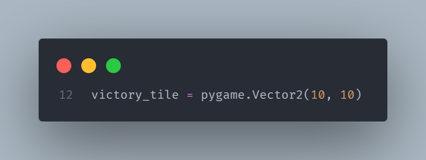
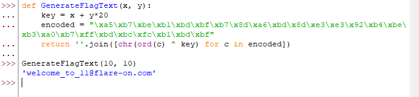

# Frog
For this challenge, we were given a game written in PyGame. Since it was the first challenge, I didn’t bother running the game and instead immediately searched for anything that might be responsible for displaying the flag. 

The flag is XOR encrypted and some coordinate is used as a key. 

The function is called when the player reaches the victory tile, which is located at *(10, 10)*

Running the function with *(10, 10)* as the arguments returns the flag. 

